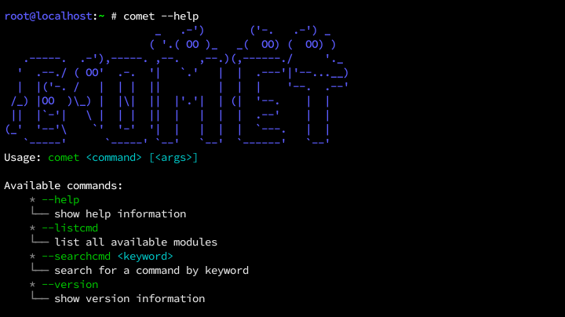
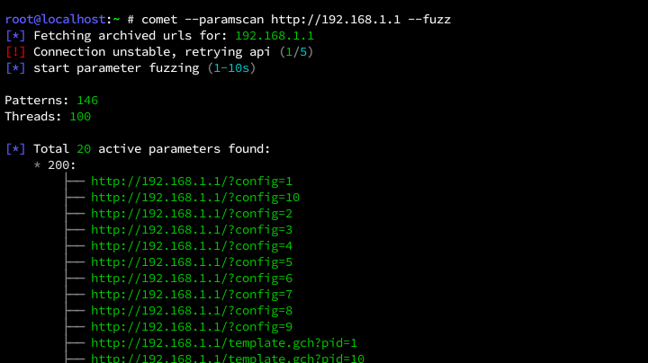
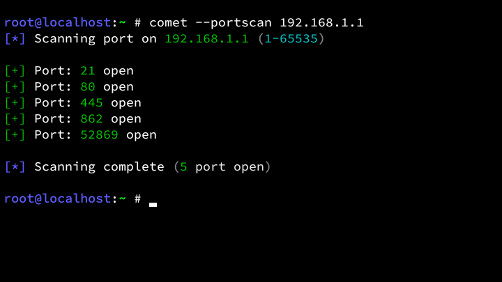

<!-- Comet Framework -->

[]()
[]()
[]()
[](LICENSE)

# Comet Framework
Comet is a lightweight security framework designed for reconnaissance. <br>
It also includes a minimal set of built-in self-audit features.

## Preview
<details>
<summary>Show Preview</summary>
<br>

<br><br>

<br><br>

<br>
</details>

## Features
- Massive username enumeration across 700+ domains.
- High-performance directory fuzzing.
- TCP port scanning.
- HTML link crawling (href extraction).
- Parameter discovery via Wayback Machine.

## Disclaimer
This project is provided for educational and authorized security research purposes only. <br>
The author is not responsible for any misuse or damage caused by this tool. <br>
Please read the
[DISCLAIMER](https://github.com/Zeronetsec/Comet/blob/main/DISCLAIMER.md)
file for full terms.

## Testing
<table>
	<tr>
		<th>OS</th>
		<th>Version</th>
	</tr>
	<tr>
		<td>Debian</td>
		<td>Trixie</td>
	</tr>
    <tr>
        <td>Ubuntu</td>
        <td>25.10</td>
    </tr>
	<tr>
		<td>Kali</td>
		<td>Rolling</td>
	</tr>
	<tr>
		<td>Termux</td>
		<td>0.118.3</td>
	</tr>
</table>

## Installation
```bash
git clone https://github.com/Zeronetsec/Comet.git
cd Comet
chmod +x install.sh
./install.sh
```

## Usage
```bash
comet --portscan <ip>
comet --osint <username>
comet --searchcmd <keyword>
comet --listcmd
comet --help
comet --version
```
And more commands.

## License
This project is licensed under the MIT License. <br>

<!-- Copyright (c) 2026 Zeronetsec -->